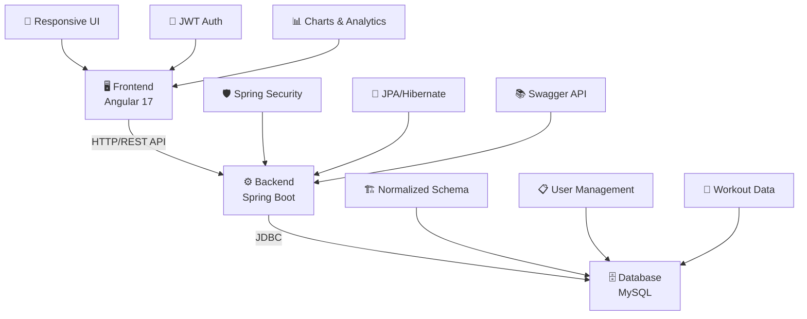

# 🏋️‍♂️ GymSync

<div align="center">

**Una plataforma web moderna para revolucionar la gestión de entrenamientos en gimnasios**

[](https://github.com/Jzzc10/gymsync)
[](https://github.com/Jzzc10/gymsync/releases)
[](./LICENSE.md)
[](https://github.com/Jzzc10/gymsync/graphs/contributors)


[🚀 Demo](#-demo-en-vivo) • [📖 Documentación](#-documentación) • [🛠️ Instalación](#-instalación-y-configuración) • [🤝 Contribuir](#-contribuciones)

</div>

---

## 🎯 Acerca del Proyecto

GymSync es una plataforma integral que conecta entrenadores, usuarios y administradores en un ecosistema digital eficiente. Automatiza rutinas de entrenamiento, mide el progreso físico y optimiza la comunicación en gimnasios modernos.

### ✨ Características Principales

- 📅 **Gestión de Entrenamientos** - Planifica y organiza sesiones personalizadas
- 📈 **Seguimiento de Progreso** - Visualiza la evolución física en tiempo real
- 📱 **Diseño Responsive** - Experiencia optimizada en móviles y desktop
- 🔐 **Seguridad Avanzada** - Autenticación JWT con encriptación bcrypt
- 👥 **Multi-Rol** - Sistema completo para clientes, entrenadores y administradores
- 📊 **Dashboard Intuitivo** - Métricas y estadísticas visuales

## 🏗️ Arquitectura del Sistema



## 👥 Roles del Sistema

| Rol | 🎯 Funciones Principales |
|-----|--------------------------|
| **👤 Cliente** | • Visualizar rutinas asignadas<br/>• Registrar progreso diario<br/>• Consultar evolución histórica |
| **💪 Entrenador** | • Crear rutinas personalizadas<br/>• Monitorear progreso de clientes<br/>• Gestionar ejercicios y planes |
| **⚙️ Administrador** | • Gestión completa de usuarios<br/>• Configuración del sistema<br/>• Métricas y reportes generales |

## 🛠️ Stack Tecnológico

<table>
<tr>
<td width="50%">

### 🎨 Frontend
- **Framework:** Angular 17.3.17
- **UI Components:** Angular Material
- **State Management:** RxJS
- **Notifications:** SweetAlert2
- **Authentication:** JWT tokens

</td>
<td width="50%">

### ⚙️ Backend
- **Framework:** Spring Boot 3.x
- **Language:** Java 23
- **Database:** MySQL + JPA/Hibernate
- **Security:** Spring Security + JWT
- **Documentation:** Swagger/OpenAPI 3

</td>
</tr>
</table>

## 📋 Requisitos del Sistema

### 🖥️ Hardware Mínimo
- **Procesador:** ≥ 2 GHz
- **Memoria RAM:** ≥ 4 GB
- **Espacio en disco:** ≥ 2 GB

### 📦 Software Requerido

| Tecnología | Versión Mínima | Versión Recomendada | 
|------------|:--------------:|:------------------:|
| ☕ Java JDK | 17+ | [23.0.2](https://jdk.java.net/) |
| 📦 Maven | 3.6+ | [3.9.9](https://maven.apache.org/download.cgi) |
| 🟢 Node.js | 18+ | [22.13.1](https://nodejs.org/) |
| 🅰️ Angular CLI | 17+ | 17.3.17 |
| 🐬 MySQL | 8.0+ | [Latest](https://dev.mysql.com/downloads/) |

## 🚀 Instalación y Configuración

### 1️⃣ Verificar Prerrequisitos

```bash
# ☕ Verificar Java
java -version

# 📦 Verificar Maven  
mvn -version

# 🟢 Verificar Node.js y npm
node -v && npm -v

# 🅰️ Verificar Angular CLI
ng version
```

### 2️⃣ Clonar el Repositorio

```bash
git clone https://github.com/Jzzc10/gymsync.git
cd gymsync
```

### 3️⃣ Configurar Base de Datos

**Crear base de datos MySQL:**

```sql
-- 🗄️ Crear base de datos
CREATE DATABASE gymsync CHARACTER SET utf8mb4 COLLATE utf8mb4_unicode_ci;

-- 👤 Crear usuario
CREATE USER 'gymsync_user'@'localhost' IDENTIFIED BY 'secure_password';

-- 🔑 Asignar permisos
GRANT ALL PRIVILEGES ON gymsync.* TO 'gymsync_user'@'localhost';
FLUSH PRIVILEGES;
```

**Configurar `application.properties`:**

```properties
# 🗄️ Database Configuration
spring.datasource.url=jdbc:mysql://localhost:3306/gymsync?useSSL=false&serverTimezone=UTC&allowPublicKeyRetrieval=true
spring.datasource.username=gymsync_user
spring.datasource.password=secure_password
spring.datasource.driver-class-name=com.mysql.cj.jdbc.Driver

# 🏗️ JPA Configuration
spring.jpa.hibernate.ddl-auto=update
spring.jpa.database-platform=org.hibernate.dialect.MySQLDialect
spring.jpa.show-sql=false

# 🔐 JWT Configuration
jwt.secret=your_super_secure_jwt_secret_key_here_minimum_256_bits
jwt.expiration=86400000

# 🌐 Server Configuration
server.port=8080

# 📚 API Documentation
springdoc.api-docs.path=/api-docs
springdoc.swagger-ui.path=/swagger-ui.html
```

### 4️⃣ Ejecutar Backend

```bash
cd backend

# 🧹 Limpiar e instalar dependencias
mvn clean install

# 🚀 Ejecutar en modo desarrollo
mvn spring-boot:run
```

✅ **Backend disponible en:** http://localhost:8080

### 5️⃣ Ejecutar Frontend

```bash
# 📂 Abrir nueva terminal
cd frontend

# 📦 Instalar dependencias
npm install

# 🚀 Ejecutar en modo desarrollo
ng serve
```

✅ **Frontend disponible en:** http://localhost:4200

## 🎮 Demo en Vivo

Una vez que ambos servicios estén ejecutándose:

| Servicio | URL | Descripción |
|----------|-----|-------------|
| 🌐 **Aplicación Principal** | http://localhost:4200 | Interfaz de usuario completa |
| 🔌 **API Backend** | http://localhost:8080 | Servicios REST |
| 📚 **Documentación API** | http://localhost:8080/swagger-ui.html | Interfaz Swagger interactiva |

## 📚 Documentación de la API

### 🔗 Endpoints Principales

<details>
<summary>👤 <strong>Gestión de Usuarios</strong></summary>

| Método | Endpoint | Descripción |
|--------|----------|-------------|
| `GET` | `/api/usuarios` | Listar todos los usuarios |
| `POST` | `/api/usuarios` | Crear nuevo usuario |
| `PUT` | `/api/usuarios/{id}` | Actualizar usuario |
| `DELETE` | `/api/usuarios/{id}` | Eliminar usuario |

</details>

<details>
<summary>💪 <strong>Rutinas de Entrenamiento</strong></summary>

| Método | Endpoint | Descripción |
|--------|----------|-------------|
| `GET` | `/api/rutinas/cliente/{id}` | Obtener rutinas de un cliente |
| `POST` | `/api/rutinas` | Crear nueva rutina |
| `PUT` | `/api/rutinas/{id}` | Actualizar rutina existente |
| `DELETE` | `/api/rutinas/{id}` | Eliminar rutina |

</details>

<details>
<summary>🏃‍♂️ <strong>Ejercicios</strong></summary>

| Método | Endpoint | Descripción |
|--------|----------|-------------|
| `GET` | `/api/ejercicios` | Listar todos los ejercicios |
| `POST` | `/api/ejercicios` | Crear nuevo ejercicio |
| `PUT` | `/api/ejercicios/{id}` | Actualizar ejercicio |

</details>

<details>
<summary>📈 <strong>Seguimiento de Progreso</strong></summary>

| Método | Endpoint | Descripción |
|--------|----------|-------------|
| `GET` | `/api/progreso/usuario/{id}` | Obtener progreso de usuario |
| `POST` | `/api/progreso` | Registrar nuevo progreso |

</details>

## 🧪 Testing

### 🔧 Backend Testing

```bash
cd backend

# 🧪 Ejecutar todos los tests
mvn test

# 📊 Tests con reporte de cobertura
mvn jacoco:prepare-agent test jacoco:report

# 🔍 Tests de integración
mvn integration-test
```

### 🎨 Frontend Testing

```bash
cd frontend

# 🧪 Tests unitarios
ng test

# 📊 Tests con cobertura
ng test --code-coverage

# 🎭 Tests end-to-end
ng e2e
```

## ❗ Solución de Problemas

<details>
<summary>🔧 <strong>Problemas Comunes y Soluciones</strong></summary>

| ❌ Error | ✅ Solución |
|----------|-------------|
| `Cannot connect to DB` | Verificar que MySQL esté ejecutándose y las credenciales sean correctas |
| `ng serve no encontrado` | Instalar Angular CLI: `npm install -g @angular/cli@17.3.17` |
| `mvn no encontrado` | Configurar `MAVEN_HOME` en variables de entorno |
| `Port 8080 already in use` | Ejecutar: `netstat -ano | findstr :8080` y terminar el proceso |
| `JWT token expired` | Reiniciar sesión en la aplicación |

</details>

## 🤝 Contribuciones

¡Las contribuciones son bienvenidas! Sigue estos pasos:

1. 🍴 **Fork** el proyecto
2. 🌿 **Crea** tu rama de características (`git checkout -b feature/amazing-feature`)
3. 💾 **Commit** tus cambios (`git commit -m 'Add amazing feature'`)
4. 📤 **Push** a la rama (`git push origin feature/amazing-feature`)
5. 🔄 **Abre** un Pull Request

### 📋 Antes de Contribuir

- Asegúrate de que los tests pasen
- Sigue las convenciones de código existentes
- Actualiza la documentación si es necesario
- Incluye tests para nuevas funcionalidades

## 📈 Roadmap

### 🚀 Versión 2.0 (En Desarrollo)

- [ ] 🤖 **IA para rutinas adaptativas** - Algoritmos de machine learning
- [ ] 📱 **App móvil nativa** - React Native para iOS/Android  
- [ ] 💬 **Chat integrado** - Comunicación en tiempo real
- [ ] 🔔 **Notificaciones push** - Recordatorios de entrenamientos
- [ ] 📊 **Analytics avanzados** - Dashboards ejecutivos

### 🎯 Versión 3.0 (Planificado)

- [ ] 🏢 **Multi-gimnasio** - Soporte para cadenas
- [ ] 🎥 **Biblioteca multimedia** - Videos de ejercicios
- [ ] 📋 **Planes nutricionales** - Integración con nutrición
- [ ] 🏆 **Gamificación** - Sistema de logros y ranking

## 📊 Estado del Proyecto


## 👨‍💻 Autor

<div align="center">

**Jorge Zárate** (Jzzc10)

[](https://github.com/Jzzc10)
[](https://linkedin.com/in/jorge-zarate)

*Desarrollador Full Stack apasionado por crear soluciones tecnológicas innovadoras*

</div>

## 📄 Licencia

Este proyecto está licenciado bajo la Licencia MIT. Consulta el archivo [LICENSE.md](LICENSE.md) para más detalles.

---

<div align="center">

**⭐ ¡Si este proyecto te resulta útil, dale una estrella!**

**📧 ¿Preguntas? Abre un [issue](https://github.com/Jzzc10/gymsync/issues)**

**🐛 ¿Encontraste un bug? [Repórtalo aquí](https://github.com/Jzzc10/gymsync/issues/new?template=bug_report.md)**

---

*Hecho con ❤️ para la comunidad fitness*

</div>